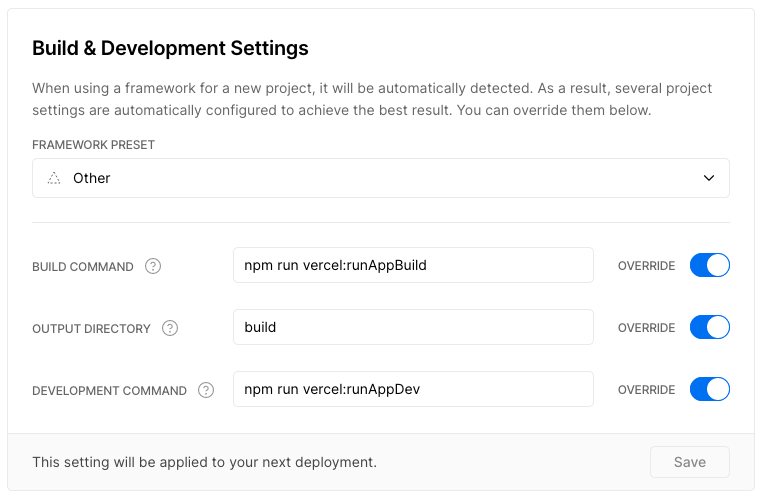

# Vercel + Snowpack + React Demo

Demo: [https://vercel-snowpack-react.now.sh/](https://vercel-snowpack-react.now.sh/)

## Overview

This project shows how Vercel can be used with Snowpack. Specifically, it demonstrates the following:

  1. `vercel dev` (v19.0.1) can run Snowpack and Vercel serverless functions _locally_. In other words, the `vercel` CLI can start the Snowpack dev server (`snowpack dev`), proxy requests to it, _and_ also handle requests to lambdas that are running locally (i.e., functions that will run on Vercel's FaaS platform when the app deployed).
  1. Snowpack's hot-module reloading can continue to work when proxied through the Vercel dev server.
  1. `vercel` can successfully build an app using `snowpack build` and deploy it to Vercel's servers.

## Pre-requisites

You'll need to create a (free) account on vercel.com. 

Again, the general intent with this demo is using Vercel and the `vercel` CLI tool. You can't use the tool without a Vercel login (and you wouldn't use the tool unless you were planning to use Vercel).

## Setup

1. Create an account on vercel.com.
1. `nvm use` (optional)
1. `npm install`
1. `npm run vercel`
    - This uses the Vercel CLI to both link the app to a Vercel project, _and_ deploy the app to Vercel.
    - You might be prompted for your Vercel login credentials if this is the first time you've run the `vercel` command.
    - The Vercel CLI will run a wizard that helps set up the project with your Vercel account (i.e., so that the `vercel` CLI can deploy it to Vercel).
    - Accept the default settings for most things, **but at _Want to override the settings?_ step, select `y`**.
    - Use the arrow keys and spacebar to "check" the boxes to override all three settings.
    - Override the three settings as follows:
      - Build Command: `npm run vercel:runAppBuild`
      - Output Directory: `build`
      - Development Command: `npm run vercel:runAppDev`
    - Example:

        ```
        $ npm run verel

        > @ deploy /Users/c/projects/playground-monorepo/vercel-snowpack-react
        > vercel

        Vercel CLI 19.0.1
        ? Set up and deploy “~/projects/playground-monorepo/vercel-snowpack-react”? [Y/n] y
        ? Which scope do you want to deploy to? charris
        ? Link to existing project? [y/N] n
        ? What’s your project’s name? vercel-snowpack-react
        ? In which directory is your code located? ./
        No framework detected. Default project settings:
        - Build Command: `npm run now-build` or `npm run build`
        - Output Directory: `public` if it exists, or `.`
        - Development Command: None
        ? Want to override the settings? [y/N] y 👈
        ? Which settings would you like to overwrite (select multiple)? 
          ▪︎ Build Command 👈
          ▪︎ Output Directory 👈
        › ▪︎ Development Command 👈
        ? What's your Build Command? npm run vercel:runAppBuild 👈
        ? What's your Output Directory? build 👈
        ? What's your Development Command? npm run vercel:runAppDev 👈
        🔗  Linked to charris/vercel-snowpack-react (created .vercel)
        🔍  Inspect: https://vercel.com/charris/vercel-snowpack-react/fabb2dk9l [4s]
        ```
        
        Note that you can also edit the Vercel project settings using their website:

        

## Running locally

`npm start` runs Snowpack and a dev version of the Vercel FaaS environment locally. You can then open http://localhost:3000/.

In other words, this will start the Vercel dev server, which in turn starts snowpack. The Vercel dev server will then handle requests to the lambada under `/api` (based on the route settings in `vercel.json`). It will also _proxy_ requests to the Snowpack dev server.

